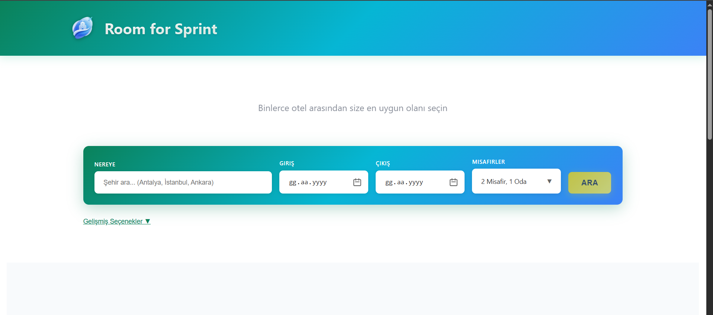
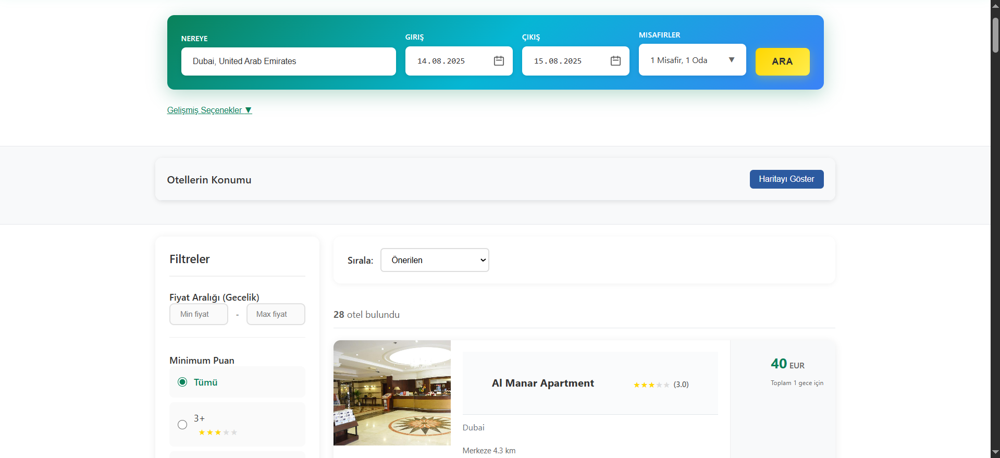
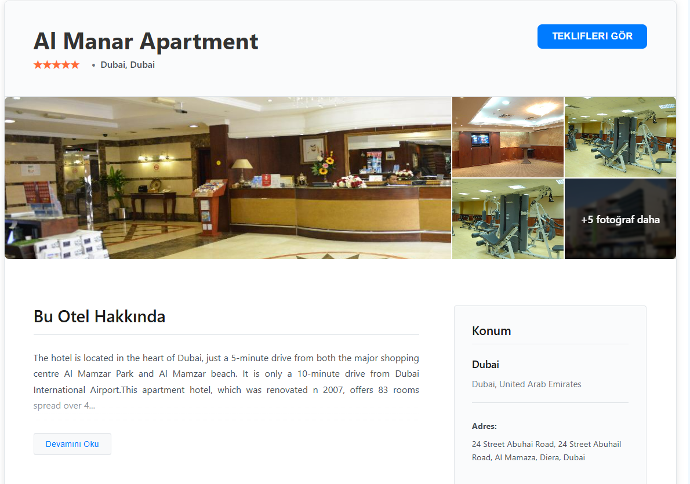
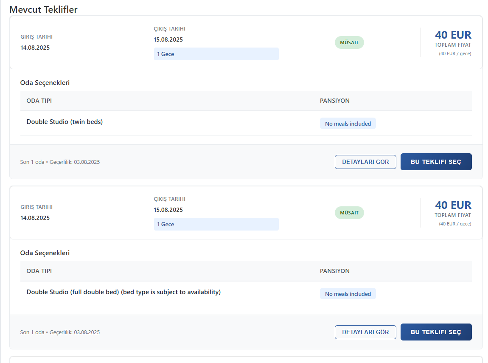
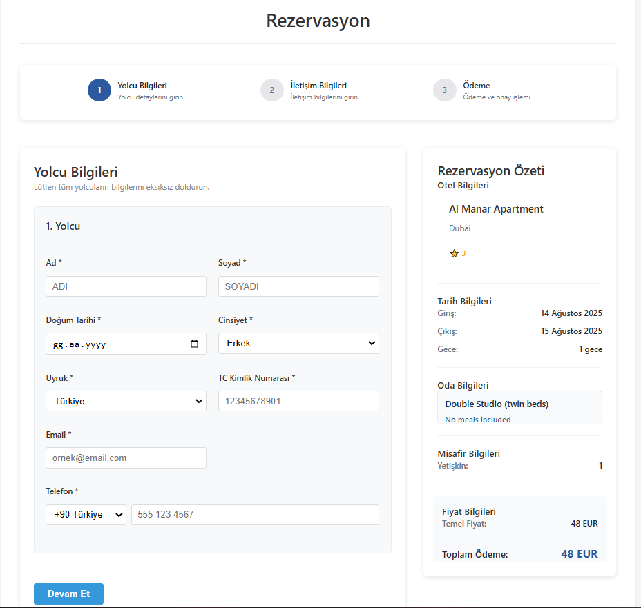
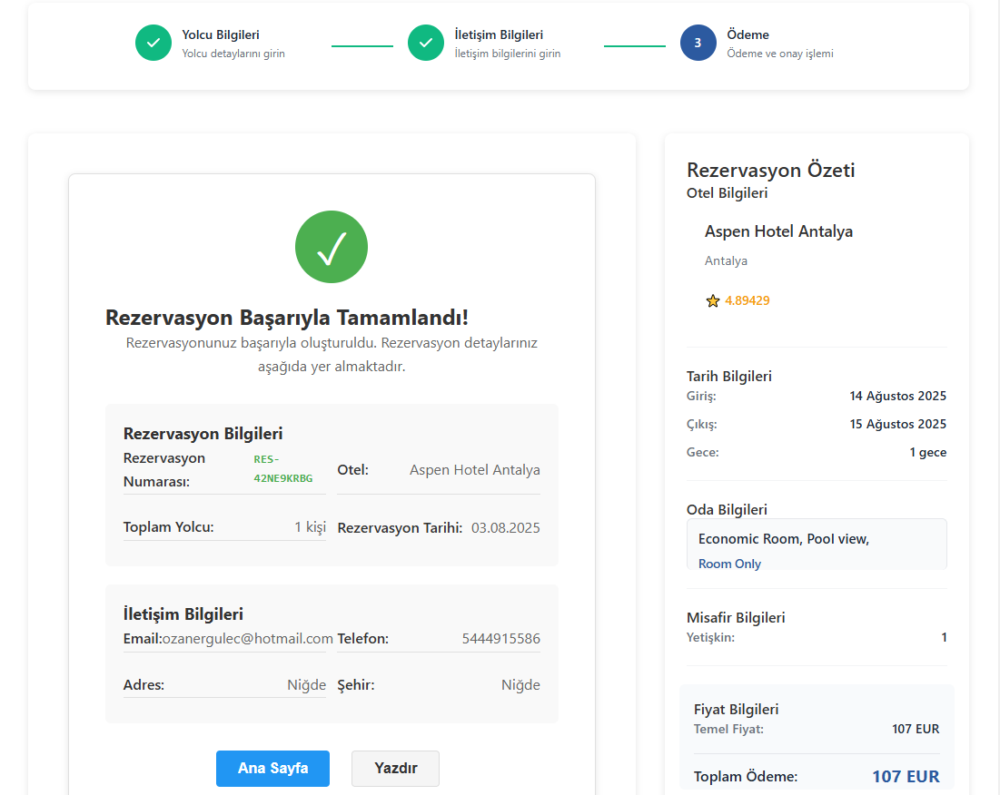

# Room for Sprint

Welcome to **Room for Sprint** — an internship project designed to help you discover hotels offering the best deals with a fast and modern web experience. This platform provides users with powerful search, filtering, and booking capabilities. The project also utilizes a robust backend infrastructure, including Redis caching and Docker-based deployment pipelines.

## Project Overview

Room for Sprint is a hotel listing and reservation web application. The goal is to allow users to quickly find hotels in their desired city, compare prices and offers, view rich hotel details, and book rooms easily.

## Key Features

- **Advanced Hotel Search:** Search hotels by city, check-in/out dates, and guest/room details.  
- **Filtering & Sorting:** Refine hotel results using price ranges, ratings, and recommendations.
- **Hotel Detail Pages:** Explore hotel features, locations, and photo galleries.
- **Booking Flow:** Step-by-step reservation including guest info, contact details, and payment summary.

### Redis Integration

To ensure a fast and scalable user experience, Room for Sprint leverages **Redis**:

- **Offers Caching:** Hotel offers are cached in Redis to provide instant access to deals and minimize backend load.
- **Price Search:** Price queries are optimized using Redis for rapid filtering and comparison.
- **Session Data:** User session and state management are handled efficiently.

### CI/CD Pipeline & Docker

Room for Sprint is built with modern DevOps principles:

- **Continuous Integration/Delivery:** Automated pipelines are set up for testing and deployment. Each change is validated and pushed seamlessly.
- **Dockerized Environment:** The entire project runs inside Docker containers, ensuring consistency across development, staging, and production.
- **Docker Hub:** Images are published to Docker Hub for easy distribution and deployment.

### UI Screenshots

**Search Hotels:**  
Users can quickly search for hotels in their desired city and set date and guest preferences.

<p>
  
</p>

**Browse & Filter Results:**  
Filter hotels by price and rating, and sort by recommendations or other criteria.

<p>
  
<p>

**Hotel Details:**  
View hotel photos, amenities, and location. 

</p>


</p>

**Booking Steps:** 
Make bookings with a clear summary and multi-step form.

</p>
 
 
</p>

## Technologies Used

- **Frontend:** React(JavaScript), CSS, HTML
- **Backend:** C# .NET, Redis for caching
- **DevOps:** Docker, Docker Hub, CI/CD pipelines

## Getting Started

1. **Clone the repository:**
   ```bash
   git clone https://github.com/ozanergulec/TV-Front-End.git
   ```
2. **Start with Docker Compose:**  
   The project includes Docker configuration for easy setup.  
   ```bash
   docker-compose up --build
   ```
3. **Environment Variables:**  
   Set up Redis connection and other required variables in your `.env` file.
4. **Access the app:**  
   Open your browser at the configured local port.

